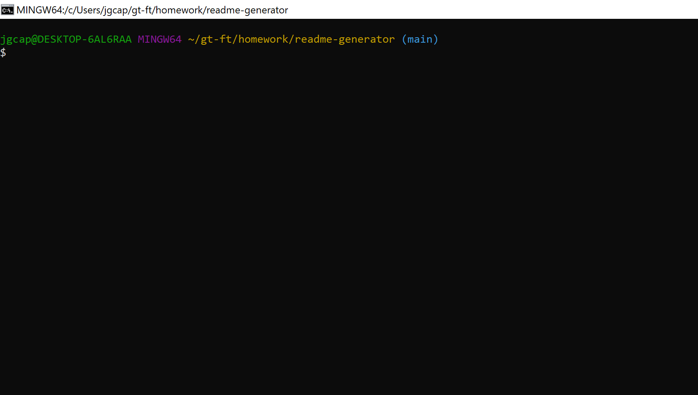
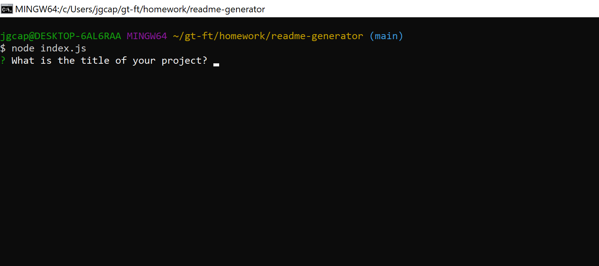
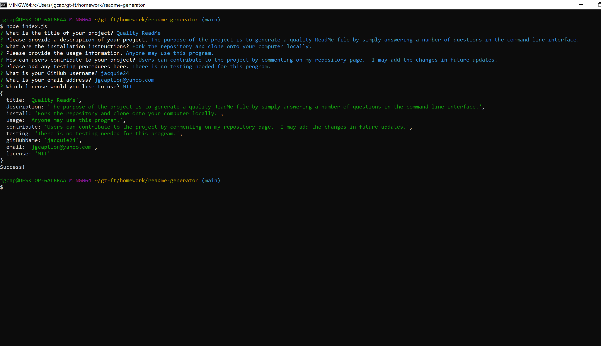
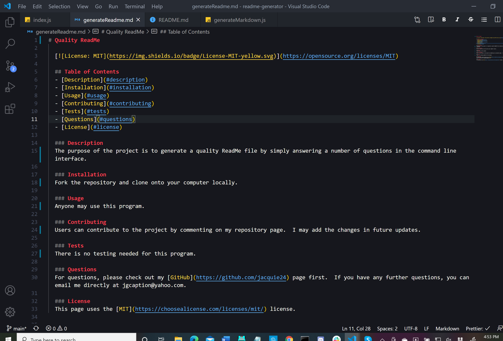

# README Generator

  
  
  ## Table of Contents
  - [Description](#description)
  - [Installation](#installation)
  - [Usage](#usage)
  - [Contributing](#contributing)
  - [Questions](#questions)
  - [License](#license)

  ### Description
  This project enables the user to write a quality README file directly in the command line interface. By simply following the prompts and answering a series of questions about their project, the user will return a readme.md file fully formatted in Markdown, including Table of Contents, section headers, link to GitHub account, email address, license of their choosing, and license badge.
  
  ### Installation
  As this is a CLI-based program, you must fork the program from my [GitHub repo](https://github.com/Jacquie24/readme-generator) and run it in the terminal locally.
  
  ### Usage
  The README Generator is available for anyone who wants to create a quality readme file with very little effort.  After forking this repo and cloning it onto your own computer, open the terminal.  Make sure you are in the correct folder for the interface, readme-generator.  
  Once you are in the correct folder, type the command node index.js, and it will run the program in the command line interface. 
  Follow the prompts through the entire series of questions. When you have finished, you should receive a "Success" message. 
  When you have finished, you should see a new file named generateReadme.md. 
  Make any final touch-ups to the file, add images, extra links, etc., then rename the file to align with industry standards, usually README.md.
  
  ### Contributing
  If you'd like to contribute -- ideas for new headings, additional licenses, etc. -- please add your comments below, and I may include them in future updates.
  
  ### Questions
  For questions, please check out my [GitHub](https://github.com/jacquie24) page first.  If you have any further questions, you can email me directly at jgcaption@yahoo.com.
  
  ### License
  This page uses the [MIT](https://choosealicense.com/licenses/mit/) license.

  

